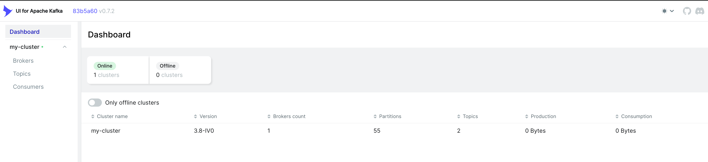
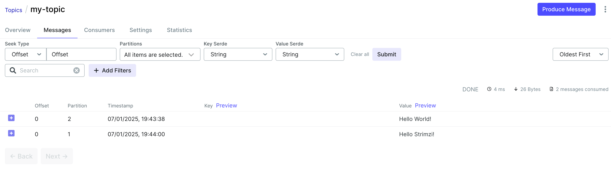

# Strimzi

Strimzi provides a way to run an Apache Kafka cluster on Kubernetes in various deployment configurations. For development it’s easy to set up a cluster in Minikube in a few minutes. For production you can tailor the cluster to your needs, using features such as rack awareness to spread brokers across availability zones, and Kubernetes taints and tolerations to run Kafka on dedicated nodes.

## Prerequisites

- Helm 3
- Kubernetes Cluster (local minikube, kind, k3s, etc.)
- kubectl

## Install Strimzi via Helm

```bash
helm upgrade -i strimzi-cluster-operator oci://quay.io/strimzi-helm/strimzi-kafka-operator --namespace strimzi --create-namespace --set watchAnyNamespace="true"
```

Now check that the Strimzi Cluster Operator is running:

```bash
kubectl get pods -n strimzi
```

You should see the Strimzi Cluster Operator pod running.

```bash
NAME                                       READY   STATUS    RESTARTS   AGE
strimzi-cluster-operator-b8f99bbc4-68btq   1/1     Running   0          17m
```

## Deploy your first Kafka cluster

First we deploy our Kafka NodePool with ephemeral storage:

```bash
kubectl apply -f - << EOF
apiVersion: kafka.strimzi.io/v1beta2
kind: KafkaNodePool
metadata:
  name: my-kafka-node-pool
  labels:
    strimzi.io/cluster: my-cluster
spec:
  replicas: 1
  roles:
  - controller
  - broker
  storage:
    type: ephemeral
EOF
```

Then we deploy our Kafka Cluster, with KRAFT enabled:

```bash
kubectl apply -f - << EOF
apiVersion: kafka.strimzi.io/v1beta2
kind: Kafka
metadata:
  name: my-cluster
  annotations:
    strimzi.io/kraft: enabled
    strimzi.io/node-pools: enabled
spec:
  kafka:
    replicas: 1
    version: 3.8.0
    storage:
      type: ephemeral
    metadataVersion: 3.8-IV0
    listeners:
    - name: plain
      port: 9092
      type: internal
      tls: false
    - name: tls
      port: 9093
      type: internal
      tls: true
    config:
      offsets.topic.replication.factor: 1
      transaction.state.log.replication.factor: 1
      transaction.state.log.min.isr: 1
      default.replication.factor: 1
      min.insync.replicas: 1
  entityOperator:
    topicOperator: {}
    userOperator: {}
EOF
```

After a few seconds, you should see the Kafka cluster running:

```bash
kubectl get pods -n default
```

You should see the Kafka cluster pods running:

```bash
NAME                                          READY   STATUS    RESTARTS   AGE
my-cluster-entity-operator-6fbb78c774-hk2nn   2/2     Running   0          43s
my-cluster-my-kafka-node-pool-0               1/1     Running   0          67s
```

## Deploy a Kafka Topic

```bash
kubectl apply -f - << EOF
apiVersion: kafka.strimzi.io/v1beta2
kind: KafkaTopic
metadata:
  name: my-topic
  labels:
    strimzi.io/cluster: my-cluster
spec:
  partitions: 5
  replicas: 1
  config:
    retention.ms: 7200000
    segment.bytes: 1073741824
EOF
```

Let's install a web UI to interact with our Kafka cluster:

create a `values.yaml`  file with the following content:

```yaml
envs:
  config:
    KAFKA_CLUSTERS_0_NAME: my-cluster
    KAFKA_CLUSTERS_0_BOOTSTRAPSERVERS: my-cluster-kafka-bootstrap:9092
yamlApplicationConfig:
  auth:
    type: disabled
```

```bash
helm repo add kafka-ui https://provectus.github.io/kafka-ui-charts
helm repo update
helm upgrade -i kafka-ui kafka-ui/kafka-ui -f values.yaml
```

Now we can access the Kafka UI:

```bash
kubectl port-forward svc/kafka-ui 8080:80
```

Now let's open the browser and navigate to `http://localhost:8080`



## Create some messages

After all the setup, let's create some messages in our Kafka cluster:

```bash
kubectl run kafka-producer -ti --image=quay.io/strimzi/kafka:0.24.0-kafka-2.8.0 --rm=true --restart=Never -- bin/kafka-console-producer.sh --broker-list my-cluster-kafka-bootstrap:9092 --topic my-topic
```

Now you can write some messages to the topic.

```bash
If you don't see a command prompt, try pressing enter.
>Hello World!
>Hello Strimzi!
```

To consume the messages, run the following command:

```bash
kubectl run kafka-consumer -ti --image=quay.io/strimzi/kafka:0.24.0-kafka-2.8.0 --rm=true --restart=Never -- bin/kafka-console-consumer.sh --bootstrap-server my-cluster-kafka-bootstrap:9092 --topic my-topic --from-beginning
```

You should see the messages you just created.

```bash
If you don't see a command prompt, try pressing enter.

Hello Strimzi!
Hello World!
```

You can also check the messages in the Kafka UI.



Congratulations! You have successfully deployed your first Kafka cluster with Strimzi.

## Extra tasks

Can you deploy a Kafka Cluster using GitOps? Try to deploy a Kafka cluster using ArgoCD and let us know how it went.

## Explore more

- [Strimzi Documentation](https://strimzi.io/documentation/)
